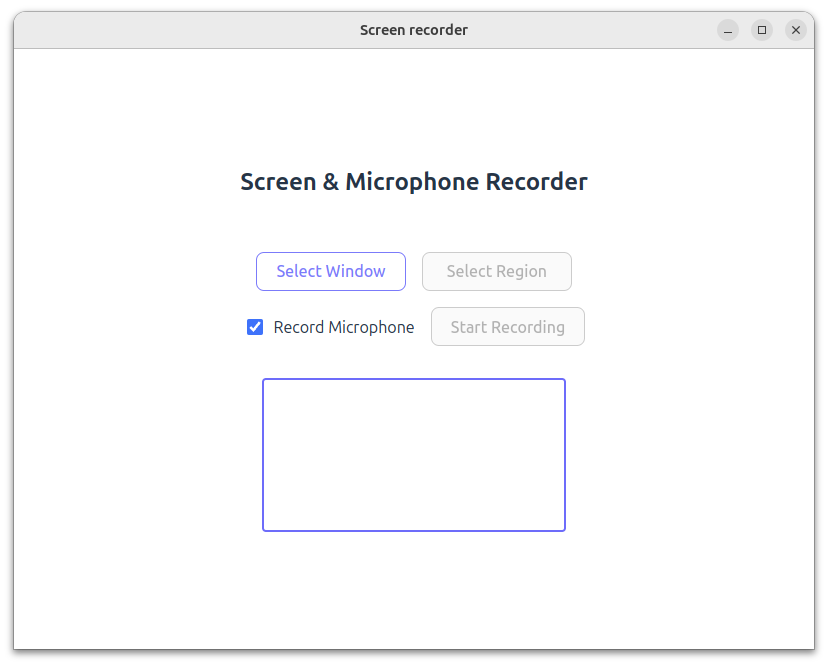

# Screen Recorder

A desktop application for recording your screen built with React, TypeScript, and the Gluon framework.



## Features

- Record any window on your system
- Select specific regions to record
- Optional microphone audio recording
- Draggable and resizable recording region
- Automatic download of recordings in WebM format
- Clean and intuitive user interface

## Technology Stack

- React + TypeScript for the UI
- Vite for building and development
- Gluon framework for desktop integration
- RecordRTC for screen recording capabilities

## Getting Started

1. Install dependencies:
```bash
npm install
```

2. Run the application:
```bash
npm start
```

## Development

- `npm run dev` - Start development server
- `npm run build` - Build for production
- `npm run lint` - Run ESLint

## License

MIT
